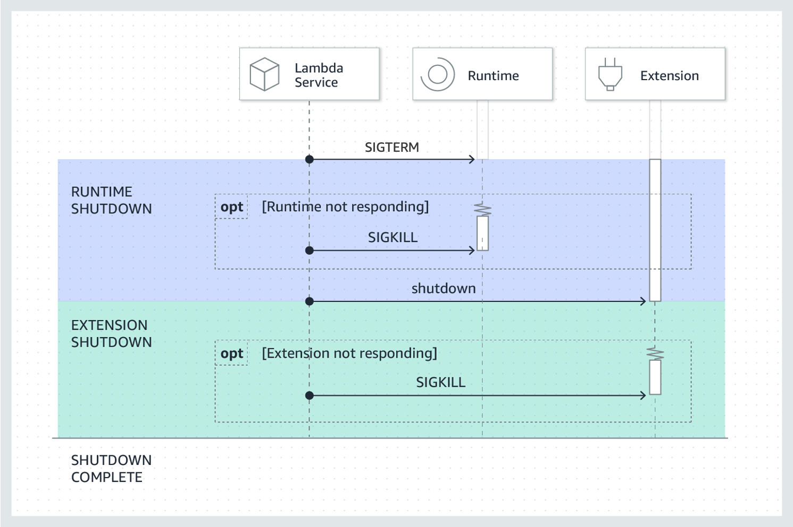

# Graceful shutdown with Lambda Extension

AWS Lambda allows developers to run their code without managing servers, automatic scaling and pay for value. Many developers use Lambda to connect with databases and Redis. But when a Lambda execution environment shuts down, the connections remain open and hold up backend resources. Databases ususally can clean those idle connections after timeout. However, developers want to gracefully clean up those connections when Lambda execution environment shuts down. Now, this can be achieved with Lambda Extensions.

For a function with registered external extensions, Lambda supports graceful shutdown. When Lambda service is about to shut down the runtime, it sends a SIGTERM signal to the runtime and then a SHUTDOWN event to each registered external extension. Developers can catch the SIGTERM signal in their lambda functions and clean up resources.

For a function with external extensions, Lambda reserves up to 300 ms (500 ms for a runtime with an internal extension) for the runtime process to perform a graceful shutdown. Lambda allocates the remainder of the 2,000 ms limit for external extensions to shut down.

If the runtime or an extension does not respond to the Shutdown event within the limit, Lambda ends the process using a SIGKILL signal.

## Demos

This repo includes three examples. Please see the details in each demo folder. 

[Node.js Demo](nodejs-demo/)

[Python Demo](python-demo/)

[Java Demo](java-demo/)