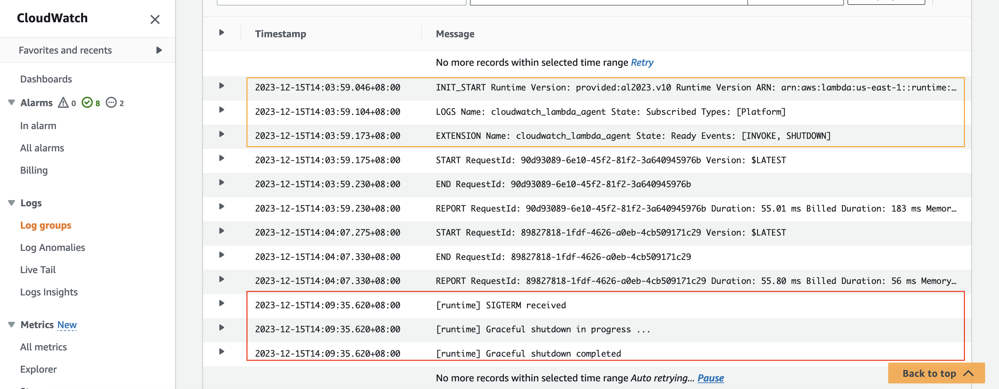

# golang graceful shutdown demo

This folder contains a simple golang function
with [CloudWatch Lambda Insight](https://docs.aws.amazon.com/lambda/latest/dg/monitoring-insights.html) enabled.
CloudWatch Lambda Insight is
monitoring and troubleshooting solution for serverless application. Its agent is an external extension. Any external
extension will work. We use Lambda Insight extension simply because it is readily available.

*It is recommended to use the
latest [Lambda Insights extension](https://docs.aws.amazon.com/AmazonCloudWatch/latest/monitoring/Lambda-Insights-extension-versions.html)*

```yaml
  Layers:
    # Add Lambda Insight Extension: https://docs.aws.amazon.com/AmazonCloudWatch/latest/monitoring/Lambda-Insights-extension-versions.html
    - !Sub "arn:aws:lambda:${AWS::Region}:580247275435:layer:LambdaInsightsExtension-Arm64:5"
  Policies:
    # Add IAM Permission for Lambda Insight Extension
    - CloudWatchLambdaInsightsExecutionRolePolicy
```

In the function, a simple signal handler is added. It will be executed when the lambda runtime receives a
`SIGTERM` signal or other  signal. You can also add more signal types yourself.

```go
// Static initialization
// SIGTERM Handler: https://docs.aws.amazon.com/lambda/latest/operatorguide/static-initialization.html
func init() {
	// Create a chan to receive os signal
	var c = make(chan os.Signal)
	// Listening for os signals that can be handled,reference: https://docs.aws.amazon.com/lambda/latest/dg/runtimes-extensions-api.html
	// Termination Signals: https://www.gnu.org/software/libc/manual/html_node/Termination-Signals.html
	signal.Notify(c, syscall.SIGTERM, syscall.SIGINT, syscall.SIGQUIT, syscall.SIGHUP)
	// do something when os signal received
	go func() {
		for s := range c {
			switch s {
			// if lambda runtime received SIGTERM signal,perform actual clean up work here.
			case syscall.SIGTERM:
				fmt.Println("[runtime] SIGTERM received")
				fmt.Println("[runtime] Graceful shutdown in progress ...")
				fmt.Println("[runtime] Graceful shutdown completed")
				os.Exit(0)
				// else if lambda runtime received other signal
			default:
				fmt.Println("[runtime] Other signal received")
				fmt.Println("[runtime] Graceful shutdown in progress ...")
				fmt.Println("[runtime] Graceful shutdown completed")
				os.Exit(0)
			}
		}
	}()
}
```

Use the following AWS SAM CLI commands to build and deploy this demo.

```bash
sam build
sam deploy
```

Take note of the output value of `GoHelloWorldApi`. Use curl to invoke the api and trigger the lambda function at least once.

```bash
curl "replace this with value of GoHelloWorldApi"
```

Waite for several minutes, check the function's log messages in CloudWatch. If you see a log line containing "SIGTERM
received", it works!

for example:

```text
2023-12-15T14:03:59.046+08:00	INIT_START Runtime Version: provided:al2023.v10 Runtime Version ARN: arn:aws:lambda:us-east-1::runtime:389fcaae1b213b40d38ed791dfb615af1a71a32d6996ff7c4afdde3d5af4b6f2
2023-12-15T14:03:59.104+08:00	LOGS Name: cloudwatch_lambda_agent State: Subscribed Types: [Platform]
2023-12-15T14:03:59.173+08:00	EXTENSION Name: cloudwatch_lambda_agent State: Ready Events: [INVOKE, SHUTDOWN]
2023-12-15T14:03:59.175+08:00	START RequestId: 90d93089-6e10-45f2-81f2-3a640945976b Version: $LATEST
2023-12-15T14:03:59.230+08:00	END RequestId: 90d93089-6e10-45f2-81f2-3a640945976b
2023-12-15T14:03:59.230+08:00	REPORT RequestId: 90d93089-6e10-45f2-81f2-3a640945976b Duration: 55.01 ms Billed Duration: 183 ms Memory Size: 128 MB Max Memory Used: 31 MB Init Duration: 127.75 ms
2023-12-15T14:04:07.275+08:00	START RequestId: 89827818-1fdf-4626-a0eb-4cb509171c29 Version: $LATEST
2023-12-15T14:04:07.330+08:00	END RequestId: 89827818-1fdf-4626-a0eb-4cb509171c29
2023-12-15T14:04:07.330+08:00	REPORT RequestId: 89827818-1fdf-4626-a0eb-4cb509171c29 Duration: 55.80 ms Billed Duration: 56 ms Memory Size: 128 MB Max Memory Used: 31 MB
2023-12-15T14:09:35.620+08:00	[runtime] SIGTERM received
2023-12-15T14:09:35.620+08:00	[runtime] Graceful shutdown in progress ...
2023-12-15T14:09:35.620+08:00	[runtime] Graceful shutdown completed 
```

## Tested Runtimes

| language version            | Identifier      | Operating system  | Architectures    | Support status |
|-----------------------------|-----------------|-------------------|------------------|----------------|
| go 1.x<br/>(1.19,1.20,1.21) | provided.al2023 | Amazon Linux 2023 | arm64<br/>x86_64 | ✅Support       |
| go 1.x<br/>(1.19,1.20,1.21) | provided.al2    | Amazon Linux 2    | arm64<br/>x86_64 | ✅Support       |

## Reference:

- [Building Lambda functions with Go](https://docs.aws.amazon.com/lambda/latest/dg/lambda-golang.html)
- [AWS SAM Documentation](https://docs.aws.amazon.com/serverless-application-model/)
