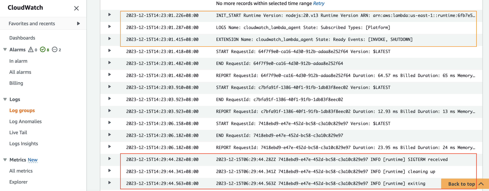

# Node.js demo

This folder contains a simple nodejs function with [CloudWatch Lambda Insight](https://docs.aws.amazon.com/lambda/latest/dg/monitoring-insights.html) enabled. CloudWatch Lambda Insight is
monitoring and troubleshooting solution for serverless application. Its agent is an external extension. Any external
extension will work. We use Lambda Insight extension simply because it is readily available.

*It is recommended to use the
latest [Lambda Insights extension](https://docs.aws.amazon.com/AmazonCloudWatch/latest/monitoring/Lambda-Insights-extension-versions.html)*
```yaml
      Layers:
        # Add Lambda Insight Extension: https://docs.aws.amazon.com/AmazonCloudWatch/latest/monitoring/Lambda-Insights-extension-versions.html
        - !Sub "arn:aws:lambda:${AWS::Region}:580247275435:layer:LambdaInsightsExtension-Arm64:5"
      Policies:
        # Add IAM Permission for Lambda Insight Extension
        - CloudWatchLambdaInsightsExecutionRolePolicy
```

In the function, a simple signal handler is added. It will be executed when the lambda runtime receives a
`SIGTERM` signal. You can also add more signal types yourself.

```javascript
process.on('SIGTERM', async () => {
    console.info('[runtime] SIGTERM received');

    console.info('[runtime] cleaning up');
    // perform actual clean up work here. 
    await new Promise(resolve => setTimeout(resolve, 200));

    console.info('[runtime] exiting');
    process.exit(0)
});
```

Use the following AWS SAM CLI commands to build and deploy this demo.

```bash
sam build --use-container
sam deploy --guided 
```

Take note of the output value of HelloWorldApi. Use curl to invoke the api and trigger the lambda function at least once.

```bash
curl "replace this with value of HelloWorldApi"
```

Waite for several minutes, check the function's log messages in CloudWatch. If you see a log line containing "SIGTERM
received", it works!

for example:

```
2023-12-15T14:23:01.226+08:00	INIT_START Runtime Version: nodejs:20.v13 Runtime Version ARN: arn:aws:lambda:us-east-1::runtime:6fb7e564fae3347add879359ec92013de1e84ce02488f36ec21448277c28707c
2023-12-15T14:23:01.287+08:00	LOGS Name: cloudwatch_lambda_agent State: Subscribed Types: [Platform]
2023-12-15T14:23:01.415+08:00	EXTENSION Name: cloudwatch_lambda_agent State: Ready Events: [INVOKE, SHUTDOWN]
2023-12-15T14:23:01.418+08:00	START RequestId: 64f7f9e0-ca16-4d30-912b-adaa8e252f64 Version: $LATEST
2023-12-15T14:23:01.482+08:00	END RequestId: 64f7f9e0-ca16-4d30-912b-adaa8e252f64
2023-12-15T14:23:01.482+08:00	REPORT RequestId: 64f7f9e0-ca16-4d30-912b-adaa8e252f64 Duration: 64.57 ms Billed Duration: 65 ms Memory Size: 128 MB Max Memory Used: 75 MB Init Duration: 189.44 ms
2023-12-15T14:23:03.910+08:00	START RequestId: c7bfa91f-1386-40f1-91fb-1db83f8eec02 Version: $LATEST
2023-12-15T14:23:03.923+08:00	END RequestId: c7bfa91f-1386-40f1-91fb-1db83f8eec02
2023-12-15T14:23:03.923+08:00	REPORT RequestId: c7bfa91f-1386-40f1-91fb-1db83f8eec02 Duration: 12.93 ms Billed Duration: 13 ms Memory Size: 128 MB Max Memory Used: 75 MB
2023-12-15T14:23:06.158+08:00	START RequestId: 7418ebd9-e47e-452d-bc58-c3a10c829e97 Version: $LATEST
2023-12-15T14:23:06.182+08:00	END RequestId: 7418ebd9-e47e-452d-bc58-c3a10c829e97
2023-12-15T14:23:06.182+08:00	REPORT RequestId: 7418ebd9-e47e-452d-bc58-c3a10c829e97 Duration: 23.95 ms Billed Duration: 24 ms Memory Size: 128 MB Max Memory Used: 76 MB
2023-12-15T14:29:44.282+08:00	2023-12-15T06:29:44.282Z 7418ebd9-e47e-452d-bc58-c3a10c829e97 INFO [runtime] SIGTERM received
2023-12-15T14:29:44.341+08:00	2023-12-15T06:29:44.341Z 7418ebd9-e47e-452d-bc58-c3a10c829e97 INFO [runtime] cleaning up
2023-12-15T14:29:44.563+08:00	2023-12-15T06:29:44.563Z 7418ebd9-e47e-452d-bc58-c3a10c829e97 INFO [runtime] exiting 
```

## Tested Runtimes

| language version | Identifier | Operating system  | Architectures    | Support status |
|------------------|------------|-------------------|------------------|----------------|
| Node.js 20       | nodejs20.x | Amazon Linux 2023 | arm64<br/>x86_64 | ✅Support       |
| Node.js 18       | nodejs18.x | Amazon Linux 2    | arm64<br/>x86_64 | ✅Support       |

## Reference:

- [Building Lambda functions with Node.js](https://docs.aws.amazon.com/lambda/latest/dg/lambda-nodejs.html)
- [AWS SAM Documentation](https://docs.aws.amazon.com/serverless-application-model/)