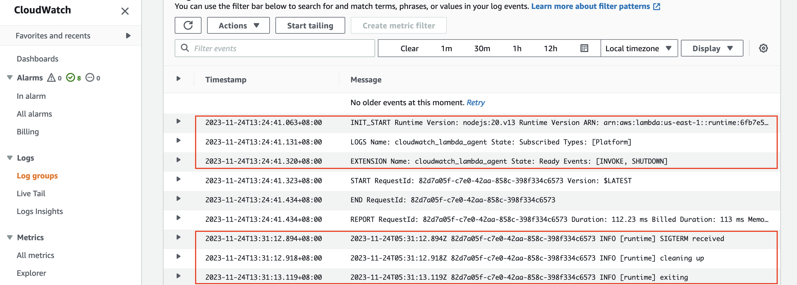

# Node.js demo

This folder contains a simple node.js function with [CloudWatch Lambda Insight](https://docs.aws.amazon.com/lambda/latest/dg/monitoring-insights.html) enabled. CloudWatch Lambda Insight is
monitoring and troubleshooting solution for serverless application. Its agent is an external extension. Any external
extension will work. We use Lambda Insight extension simply because it is readily available.

*It is recommended to use the
latest [Lambda Insights extension](https://docs.aws.amazon.com/AmazonCloudWatch/latest/monitoring/Lambda-Insights-extension-versions.html)*
```yaml
    Properties:
      Layers:
        - !Sub "arn:aws:lambda:${AWS::Region}:580247275435:layer:LambdaInsightsExtension:14" # Add Lambda Insight Extension
      Policies:
        - CloudWatchLambdaInsightsExecutionRolePolicy # Add IAM Permission for Lambda Insight Extension
```

In the function, a simple SIGTERM signal handler is added. It will be executed when the lambda runtime receives a
SIGTERM signal.

```javascript
process.on('SIGTERM', async () => {
    console.info('[runtime] SIGTERM received');

    console.info('[runtime] cleaning up');
    // perform actual clean up work here. 
    await new Promise(resolve => setTimeout(resolve, 200));

    console.info('[runtime] exiting');
    process.exit(0)
});
```

Use the following AWS SAM CLI commands to build and deploy this demo.

```bash
sam build --use-container
sam deploy --guided 
```

Take note of the output value of HelloWorldApi. Use curl to invoke the api and trigger the lambda function once.

```bash
curl "replace this with value of HelloWorldApi"
```

Waite for several minutes, check the function's log messages in CloudWatch. If you see a log line containing "SIGTERM
received", it works!

for example:

```
2023-11-24T13:24:41.063+08:00	INIT_START Runtime Version: nodejs:20.v13 Runtime Version ARN: arn:aws:lambda:us-east-1::runtime:6fb7e564fae3347add879359ec92013de1e84ce02488f36ec21448277c28707c
2023-11-24T13:24:41.131+08:00	LOGS Name: cloudwatch_lambda_agent State: Subscribed Types: [Platform]
2023-11-24T13:24:41.320+08:00	EXTENSION Name: cloudwatch_lambda_agent State: Ready Events: [INVOKE, SHUTDOWN]
2023-11-24T13:24:41.323+08:00	START RequestId: 82d7a05f-c7e0-42aa-858c-398f334c6573 Version: $LATEST
2023-11-24T13:24:41.434+08:00	END RequestId: 82d7a05f-c7e0-42aa-858c-398f334c6573
2023-11-24T13:24:41.434+08:00	REPORT RequestId: 82d7a05f-c7e0-42aa-858c-398f334c6573 Duration: 112.23 ms Billed Duration: 113 ms Memory Size: 128 MB Max Memory Used: 75 MB Init Duration: 258.04 ms
2023-11-24T13:31:12.894+08:00	2023-11-24T05:31:12.894Z 82d7a05f-c7e0-42aa-858c-398f334c6573 INFO [runtime] SIGTERM received
2023-11-24T13:31:12.918+08:00	2023-11-24T05:31:12.918Z 82d7a05f-c7e0-42aa-858c-398f334c6573 INFO [runtime] cleaning up
2023-11-24T13:31:13.119+08:00	2023-11-24T05:31:13.119Z 82d7a05f-c7e0-42aa-858c-398f334c6573 INFO [runtime] exiting 
```

## Tested Runtimes

| language version | Identifier | Operating system  | Architectures    | Support status |
|------------------|------------|-------------------|------------------|----------------|
| Node.js 20       | nodejs20.x | Amazon Linux 2023 | arm64<br/>x86_64 | ✅Support       |
| Node.js 18       | nodejs18.x | Amazon Linux 2    | arm64<br/>x86_64 | ✅Support       |

## Reference:

- [Building Lambda functions with Node.js](https://docs.aws.amazon.com/lambda/latest/dg/lambda-nodejs.html)
- [AWS SAM Documentation](https://docs.aws.amazon.com/serverless-application-model/)