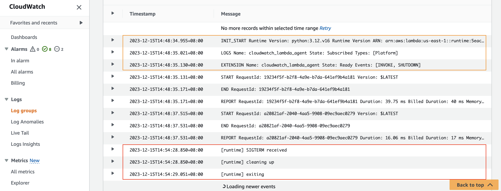

# Python demo

> ❗ **WARNING:** Graceful shutdown using SIGTERM is currently only compatible with python 3.7 and 3.12 runtimes. See #2

This folder contains a simple python function with CloudWatch Lambda Insight enabled. CloudWatch Lambda Insight is monitoring and troubleshooting solution for serverless application. Its agent is an external extension. Any external extension will work. We use Lambda Insight extension simply because it is readily available.

```yaml
    Properties:
      Layers:
        # Add Lambda Insight Extension: https://docs.aws.amazon.com/AmazonCloudWatch/latest/monitoring/Lambda-Insights-extension-versions.html
        - !Sub "arn:aws:lambda:${AWS::Region}:580247275435:layer:LambdaInsightsExtension-Arm64:5"
      Policies:
        # Add IAM Permission for Lambda Insight Extension
        - CloudWatchLambdaInsightsExecutionRolePolicy
```

In the function, a simple `SIGTERM` signal handler is added. It will be executed when the lambda runtime receives a `SIGTERM` signal.

```python
def exit_gracefully(signum, frame):
    r"""
    SIGTERM Handler: https://docs.aws.amazon.com/lambda/latest/operatorguide/static-initialization.html
    Listening for os signals that can be handled,reference: https://docs.aws.amazon.com/lambda/latest/dg/runtimes-extensions-api.html
    Termination Signals: https://www.gnu.org/software/libc/manual/html_node/Termination-Signals.html
    """
    print("[runtime] SIGTERM received")

    print("[runtime] cleaning up")
    # perform actual clean up work here.
    time.sleep(0.2)

    print("[runtime] exiting")
    sys.exit(0)


signal.signal(signal.SIGTERM, exit_gracefully)

```

Use the following AWS SAM CLI commands to build and deploy this demo.

```bash
sam build --use-container
sam deploy --guided 
```

Take note of the output value of HelloWorldApi. Use curl to invoke the api and trigger the lambda function at least once.

```bash
curl "replace this with value of HelloWorldApi"
```

Waite for serveral minutes, check the function's log messages in CloudWatch. If you see a log line containing "SIGTERM
received", it works!

for example:

```
2023-12-15T14:48:34.955+08:00	INIT_START Runtime Version: python:3.12.v16 Runtime Version ARN: arn:aws:lambda:us-east-1::runtime:5eaca0ecada617668d4d59f66bf32f963e95d17ca326aad52b85465d04c429f5
2023-12-15T14:48:35.021+08:00	LOGS Name: cloudwatch_lambda_agent State: Subscribed Types: [Platform]
2023-12-15T14:48:35.130+08:00	EXTENSION Name: cloudwatch_lambda_agent State: Ready Events: [INVOKE, SHUTDOWN]
2023-12-15T14:48:35.131+08:00	START RequestId: 19234f5f-b2f8-4a9e-b7da-641ef9b4a181 Version: $LATEST
2023-12-15T14:48:35.171+08:00	END RequestId: 19234f5f-b2f8-4a9e-b7da-641ef9b4a181
2023-12-15T14:48:35.171+08:00	REPORT RequestId: 19234f5f-b2f8-4a9e-b7da-641ef9b4a181 Duration: 39.75 ms Billed Duration: 40 ms Memory Size: 128 MB Max Memory Used: 45 MB Init Duration: 175.18 ms
2023-12-15T14:48:37.515+08:00	START RequestId: a20821af-2040-4aa5-9908-09ec9aec0279 Version: $LATEST
2023-12-15T14:48:37.531+08:00	END RequestId: a20821af-2040-4aa5-9908-09ec9aec0279
2023-12-15T14:48:37.531+08:00	REPORT RequestId: a20821af-2040-4aa5-9908-09ec9aec0279 Duration: 16.06 ms Billed Duration: 17 ms Memory Size: 128 MB Max Memory Used: 45 MB
2023-12-15T14:54:28.850+08:00	[runtime] SIGTERM received
2023-12-15T14:54:28.850+08:00	[runtime] cleaning up
2023-12-15T14:54:29.051+08:00	[runtime] exiting 
```


## Tested Runtimes

| language version       | Identifier                                            | Operating system  | Architectures    | Support status |
|------------------------|-------------------------------------------------------|-------------------|------------------|----------------|
| Python 3.12            | python3.12                                            | Amazon Linux 2023 | arm64<br/>x86_64 | ✅ Support      |
| Python 3.11 or earlier | python3.11<br/>python3.10<br/>python3.9<br/>python3.8 | Amazon Linux 2    | arm64<br/>x86_64 | ❌ NOT Support  |

## Reference:

- [Building Lambda functions with Python](https://docs.aws.amazon.com/lambda/latest/dg/lambda-python.html)
- [Python 3.12 runtime now available in AWS Lambda](https://aws.amazon.com/cn/blogs/compute/python-3-12-runtime-now-available-in-aws-lambda/)
- [AWS SAM Documentation](https://docs.aws.amazon.com/serverless-application-model/)
