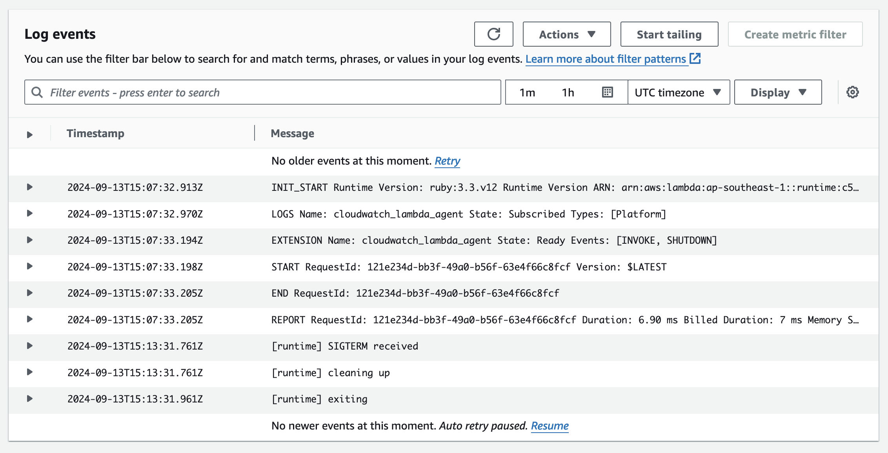

# Ruby demo

This folder contains a simple Ruby function with CloudWatch Lambda Insight enabled. CloudWatch Lambda Insight is monitoring and troubleshooting solution for serverless application. Its agent is an external extension. Any external extension will work. We use Lambda Insight extension simply because it is readily available.

*It is recommended to use the latest [Lambda Insights extension](https://docs.aws.amazon.com/AmazonCloudWatch/latest/monitoring/Lambda-Insights-extension-versions.html)*
```yaml
Properties:
  Layers:
    # Add Lambda Insight Extension: https://docs.aws.amazon.com/AmazonCloudWatch/latest/monitoring/Lambda-Insights-extension-versions.html
    - !Sub "arn:aws:lambda:${AWS::Region}:580247275435:layer:LambdaInsightsExtension-Arm64:20"
  Policies:
    # Add IAM Permission for Lambda Insight Extension
    - CloudWatchLambdaInsightsExecutionRolePolicy
```

In the function, a simple `SIGTERM` signal handler is added. It will be executed when the lambda runtime receives a `SIGTERM` signal. Note that the signal handler is wrapped in a thread to avoid `can't be called from trap context` error when working with IO.
```ruby
def exit_gracefully
  puts "[runtime] SIGTERM received"
  puts "[runtime] cleaning up"

  # perform actual clean up work here.
  sleep 0.2

  puts "[runtime] exiting"
end

Signal.trap("TERM") do |signal|
  Thread.new { exit_gracefully }.join
end
```

Use the following AWS SAM CLI commands to build and deploy this demo.

```bash
sam build --use-container
sam deploy --guided
```

Take note of the output value of `HelloWorldUrl`. Use curl to invoke the url and trigger the lambda function at least once.

```bash
curl "replace this with value of HelloWorldUrl"
```

Wait for serveral minutes, check the function's log messages in CloudWatch. If you see a log line containing "SIGTERM
received", it works!

For example:

```
2024-09-13T15:07:32.913Z	INIT_START Runtime Version: ruby:3.3.v12 Runtime Version ARN: arn:aws:lambda:ap-southeast-1::runtime:c52b006a8662802f4181b489d3c890a707346347109117f99c7095ee3c4b349d
2024-09-13T15:07:32.970Z	LOGS Name: cloudwatch_lambda_agent State: Subscribed Types: [Platform]
2024-09-13T15:07:33.194Z	EXTENSION Name: cloudwatch_lambda_agent State: Ready Events: [INVOKE, SHUTDOWN]
2024-09-13T15:07:33.198Z	START RequestId: 121e234d-bb3f-49a0-b56f-63e4f66c8fcf Version: $LATEST
2024-09-13T15:07:33.205Z	END RequestId: 121e234d-bb3f-49a0-b56f-63e4f66c8fcf
2024-09-13T15:07:33.205Z	REPORT RequestId: 121e234d-bb3f-49a0-b56f-63e4f66c8fcf Duration: 6.90 ms Billed Duration: 7 ms Memory Size: 10240 MB Max Memory Used: 64 MB Init Duration: 281.37 ms
2024-09-13T15:13:31.761Z	[runtime] SIGTERM received
2024-09-13T15:13:31.761Z	[runtime] cleaning up
2024-09-13T15:13:31.961Z	[runtime] exiting
```

## Tested Runtimes

| language version       | Identifier                                            | Operating system  | Architectures    | Support status |
|------------------------|-------------------------------------------------------|-------------------|------------------|----------------|
| Ruby 3.3               | ruby3.3                                               | Amazon Linux 2023 | arm64<br/>x86_64 | ✅ Support      |
| Ruby 3.2               | ruby3.2                                               | Amazon Linux 2    | arm64<br/>x86_64 | ✅ Support      |

## Reference:

- [Building Lambda functions with Ruby](https://docs.aws.amazon.com/lambda/latest/dg/lambda-ruby.html)
- [AWS SAM Documentation](https://docs.aws.amazon.com/serverless-application-model/)
