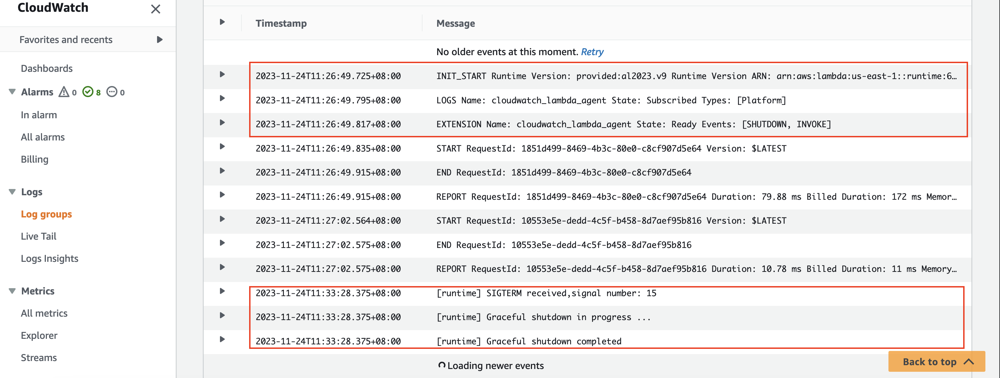

# rust graceful shutdown demo

This folder contains a simple rust function with [CloudWatch Lambda Insight](https://docs.aws.amazon.com/lambda/latest/dg/monitoring-insights.html) enabled. CloudWatch Lambda Insight is
monitoring and troubleshooting solution for serverless application. Its agent is an external extension. Any external
extension will work. We use Lambda Insight extension simply because it is readily available.

*It is recommended to use the latest [Lambda Insights extension](https://docs.aws.amazon.com/AmazonCloudWatch/latest/monitoring/Lambda-Insights-extension-versions.html)*
```yaml
  Layers:
    # https://docs.aws.amazon.com/AmazonCloudWatch/latest/monitoring/Lambda-Insights-extension-versions.html
    - !Sub "arn:aws:lambda:${AWS::Region}:580247275435:layer:LambdaInsightsExtension-Arm64:5" # Add Lambda Insight Extension
  Policies:
    # Add IAM Permission for Lambda Insight Extension
    - CloudWatchLambdaInsightsExecutionRolePolicy
```

In the function, a simple `SIGTERM` signal handler is added. It will be executed when the lambda runtime receives
a `SIGTERM` signal.

```rust
// Handle SIGTERM signal: https://rust-cli.github.io/book/in-depth/signals.html
let mut signals = Signals::new(&[SIGTERM])?;
thread::spawn(move || {
    for sig_num in signals.forever() {
        println!("[runtime] SIGTERM received,signal number: {:?}", sig_num);
        println!("[runtime] Graceful shutdown in progress ...");
        println!("[runtime] Graceful shutdown completed");
        std::process::exit(0);
    }
});
```

Use the following AWS SAM CLI commands to build and deploy this demo.

```bash
# https://docs.aws.amazon.com/serverless-application-model/latest/developerguide/building-rust.html#building-rust-prerequisites
sam build --beta-features
sam deploy
```

Take note of the output value of `RustHelloWorldApi`. Use curl to invoke the api and trigger the lambda function once.

```bash
curl "replace this with value of RustHelloWorldApi"
```

Waite for several minutes, check the function's log messages in CloudWatch. If you see a log line containing "SIGTERM
received", it works!

for example:

```text
2023-11-24T11:26:49.725+08:00	INIT_START Runtime Version: provided:al2023.v9 Runtime Version ARN: arn:aws:lambda:us-east-1::runtime:68313de216b90a01e19138b97177c40478ef50b63a22b29f152b960070428ae8
2023-11-24T11:26:49.795+08:00	LOGS Name: cloudwatch_lambda_agent State: Subscribed Types: [Platform]
2023-11-24T11:26:49.817+08:00	EXTENSION Name: cloudwatch_lambda_agent State: Ready Events: [SHUTDOWN, INVOKE]
2023-11-24T11:26:49.835+08:00	START RequestId: 1851d499-8469-4b3c-80e0-c8cf907d5e64 Version: $LATEST
2023-11-24T11:26:49.915+08:00	END RequestId: 1851d499-8469-4b3c-80e0-c8cf907d5e64
2023-11-24T11:26:49.915+08:00	REPORT RequestId: 1851d499-8469-4b3c-80e0-c8cf907d5e64 Duration: 79.88 ms Billed Duration: 172 ms Memory Size: 128 MB Max Memory Used: 26 MB Init Duration: 91.80 ms
2023-11-24T11:27:02.564+08:00	START RequestId: 10553e5e-dedd-4c5f-b458-8d7aef95b816 Version: $LATEST
2023-11-24T11:27:02.575+08:00	END RequestId: 10553e5e-dedd-4c5f-b458-8d7aef95b816
2023-11-24T11:27:02.575+08:00	REPORT RequestId: 10553e5e-dedd-4c5f-b458-8d7aef95b816 Duration: 10.78 ms Billed Duration: 11 ms Memory Size: 128 MB Max Memory Used: 26 MB
2023-11-24T11:33:28.375+08:00	[runtime] SIGTERM received,signal number: 15
2023-11-24T11:33:28.375+08:00	[runtime] Graceful shutdown in progress ...
2023-11-24T11:33:28.375+08:00	[runtime] Graceful shutdown completed 
```


## Tested Runtimes

| language version | Identifier      | Operating system  | Architectures    | Support status |
|------------------|-----------------|-------------------|------------------|----------------|
| rust             | provided.al2023 | Amazon Linux 2023 | arm64<br/>x86_64 | ✅Support       |
| rust             | provided.al2    | Amazon Linux 2    | arm64<br/>x86_64 | ✅Support       |

> **Note**: The [Rust runtime client](https://github.com/awslabs/aws-lambda-rust-runtime)
is an experimental package. It is subject to change and intended only for evaluation purposes.

> **Note**: Make sure your [SAM CLI version](https://docs.aws.amazon.com/serverless-application-model/latest/developerguide/install-sam-cli.html) is the latest version,SAM CLI version 1.103.0 or newer is recommended.


## Reference:
- [Building Lambda functions with Rust](https://docs.aws.amazon.com/lambda/latest/dg/lambda-rust.html)
- [AWS SAM Documentation](https://docs.aws.amazon.com/serverless-application-model/)
  - [Building Rust Lambda functions with Cargo Lambda](https://docs.aws.amazon.com/serverless-application-model/latest/developerguide/building-rust.html)
- [cargo-lambda](https://www.cargo-lambda.info/)