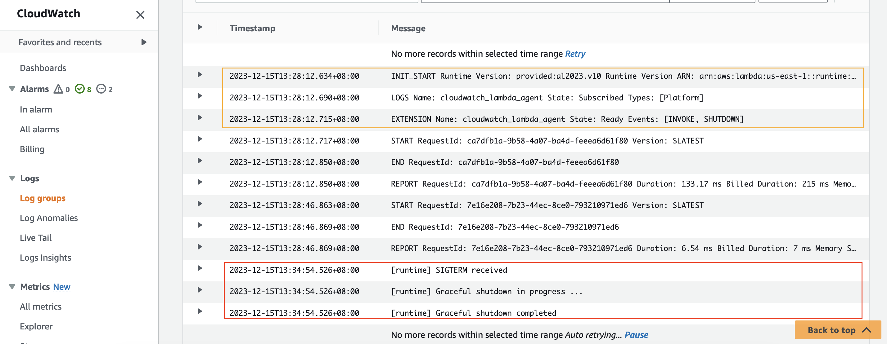

# rust graceful shutdown demo

## Generating graceful shutdown signals

In order for Lambda to support graceful shutdown, at least one extension must be registered for your function.
This folder contains two examples demonstrating this. One uses an external extension, and one uses Rust `lambda-runtime` crate's
[`spawn_graceful_shutdown_handler() helper`] function,
which is backed by an internal extension.

For more information on the difference between the two, see [these Lambda Extensions API docs](https://docs.aws.amazon.com/lambda/latest/dg/runtimes-extensions-api.html).

### Internal extension

The simplest way to enable shutdown signals in a `Rust` lambda is via [`spawn_graceful_shutdown_handler() helper`] function in the `lambda-runtime`. Under the hood, this registers an internal extension from wtihin your handler process. 

The registered extension is a dummy no-op extension that doesn't subscribe to any events. This is very lightweight since it spawns a `tokio` task that keeps open a long-running connection with the Lambda execution environment, that never receives data. It therefore is essentially never woken and just occupies a small amount of heap memory. 

The helper also accepts a callback that includes the logic to fire on `SIGTERM` or `SIGINT`, and generates the boilerplate to react to those signals for us. 

You can also manually implement your own internal extension registration, if you want an internal extension that has
useful functionality. For instance, see this example of an internal extension that flushes telemetry: [ref](https://github.com/awslabs/aws-lambda-rust-runtime/blob/main/examples/extension-internal-flush). In that case, you could still use the helper, or you could also directly spawn signal handlers as demonstrated in the [Signal handling in the function](#signal-handling-in-the-function).

### External extension

Alternately, you can receive shutdown signals if an external extension is registered with the runtime. An external extension runs as a separate process alongside your function's process. This does not require code changes in your function handler (besides signal handling logic), but it might add additional overhead if you don't actually need an external extension.

The external extension example assumes that the [CloudWatch Lambda Insight](https://docs.aws.amazon.com/lambda/latest/dg/monitoring-insights.html) is enabled. CloudWatch Lambda Insight is a
monitoring and troubleshooting solution for serverless application. Its agent is an external extension. Any external
extension will work. We use Lambda Insight extension simply because it is readily available and useful. Note that this may incurs additional billing fees.

*It is recommended to use the latest [Lambda Insights extension](https://docs.aws.amazon.com/AmazonCloudWatch/latest/monitoring/Lambda-Insights-extension-versions.html)*
```yaml
  Layers:
    # https://docs.aws.amazon.com/AmazonCloudWatch/latest/monitoring/Lambda-Insights-extension-versions.html
    - !Sub "arn:aws:lambda:${AWS::Region}:580247275435:layer:LambdaInsightsExtension-Arm64:5" # Add Lambda Insight Extension
  Policies:
    # Add IAM Permission for Lambda Insight Extension
    - CloudWatchLambdaInsightsExecutionRolePolicy
```

## Signal handling in the function

Inside our external extension example, or inside the [`spawn_graceful_shutdown_handler() helper`], a simple signal handler is added. It will be executed when the lambda runtime receives a `SIGTERM`、`SIGINT` signal. You can customize the logic that will fire when one of the signals is received.


```rust
// Handle SIGTERM signal:
// https://tokio.rs/tokio/topics/shutdown
// https://rust-cli.github.io/book/in-depth/signals.html
tokio::spawn(async move {
    let mut sigint = signal(SignalKind::interrupt()).unwrap();
    let mut sigterm = signal(SignalKind::terminate()).unwrap();
    tokio::select! {
        _sigint = sigint.recv() => {
            println!("[runtime] SIGINT received");
            println!("[runtime] Graceful shutdown in progress ...");
            // additional logic
            println!("[runtime] Graceful shutdown completed");
            std::process::exit(0);
        },
        _sigterm = sigterm.recv()=> {
            println!("[runtime] SIGTERM received");
            println!("[runtime] Graceful shutdown in progress ...");
            // additional logic
            println!("[runtime] Graceful shutdown completed");
            std::process::exit(0);
        },
    }
});
```

## Deploy and Test

Use the following AWS SAM CLI commands from within one of the two examples' subdirectories to build and deploy this demo.

```bash
# https://docs.aws.amazon.com/serverless-application-model/latest/developerguide/building-rust.html#building-rust-prerequisites
sam build --beta-features
sam deploy
```

Take note of the output value of `RustHelloWorldApi`. Use curl to invoke the api and trigger the lambda function at least once.

```bash
curl "replace this with value of RustHelloWorldApi"
```

Wait for several minutes, check the function's log messages in CloudWatch. If you see a log line containing "SIGTERM
received", it works!

for example:

```text
2023-12-15T13:28:12.634+08:00	INIT_START Runtime Version: provided:al2023.v10 Runtime Version ARN: arn:aws:lambda:us-east-1::runtime:389fcaae1b213b40d38ed791dfb615af1a71a32d6996ff7c4afdde3d5af4b6f2
2023-12-15T13:28:12.690+08:00	LOGS Name: cloudwatch_lambda_agent State: Subscribed Types: [Platform]
2023-12-15T13:28:12.715+08:00	EXTENSION Name: cloudwatch_lambda_agent State: Ready Events: [INVOKE, SHUTDOWN]
2023-12-15T13:28:12.717+08:00	START RequestId: ca7dfb1a-9b58-4a07-ba4d-feeea6d61f80 Version: $LATEST
2023-12-15T13:28:12.850+08:00	END RequestId: ca7dfb1a-9b58-4a07-ba4d-feeea6d61f80
2023-12-15T13:28:12.850+08:00	REPORT RequestId: ca7dfb1a-9b58-4a07-ba4d-feeea6d61f80 Duration: 133.17 ms Billed Duration: 215 ms Memory Size: 128 MB Max Memory Used: 26 MB Init Duration: 81.74 ms
2023-12-15T13:28:46.863+08:00	START RequestId: 7e16e208-7b23-44ec-8ce0-793210971ed6 Version: $LATEST
2023-12-15T13:28:46.869+08:00	END RequestId: 7e16e208-7b23-44ec-8ce0-793210971ed6
2023-12-15T13:28:46.869+08:00	REPORT RequestId: 7e16e208-7b23-44ec-8ce0-793210971ed6 Duration: 6.54 ms Billed Duration: 7 ms Memory Size: 128 MB Max Memory Used: 26 MB
2023-12-15T13:34:54.526+08:00	[runtime] SIGTERM received
2023-12-15T13:34:54.526+08:00	[runtime] Graceful shutdown in progress ...
2023-12-15T13:34:54.526+08:00	[runtime] Graceful shutdown completed 
```


## Tested Runtimes

| language version | Identifier      | Operating system  | Architectures    | Support status |
|------------------|-----------------|-------------------|------------------|----------------|
| rust             | provided.al2023 | Amazon Linux 2023 | arm64<br/>x86_64 | ✅Support       |
| rust             | provided.al2    | Amazon Linux 2    | arm64<br/>x86_64 | ✅Support       |

> **Note**: The [Rust runtime client](https://github.com/awslabs/aws-lambda-rust-runtime)
is an experimental package. It is subject to change and intended only for evaluation purposes.

> **Note**: Make sure your [SAM CLI version](https://docs.aws.amazon.com/serverless-application-model/latest/developerguide/install-sam-cli.html) is the latest version,SAM CLI version 1.103.0 or newer is recommended.


## Reference:
- [Building Lambda functions with Rust](https://docs.aws.amazon.com/lambda/latest/dg/lambda-rust.html)
- [AWS SAM Documentation](https://docs.aws.amazon.com/serverless-application-model/)
  - [Building Rust Lambda functions with Cargo Lambda](https://docs.aws.amazon.com/serverless-application-model/latest/developerguide/building-rust.html)
- [cargo-lambda](https://www.cargo-lambda.info/)


[`spawn_graceful_shutdown_handler() helper`]: https://docs.rs/lambda_runtime/latest/lambda_runtime/fn.spawn_graceful_shutdown_handler.html